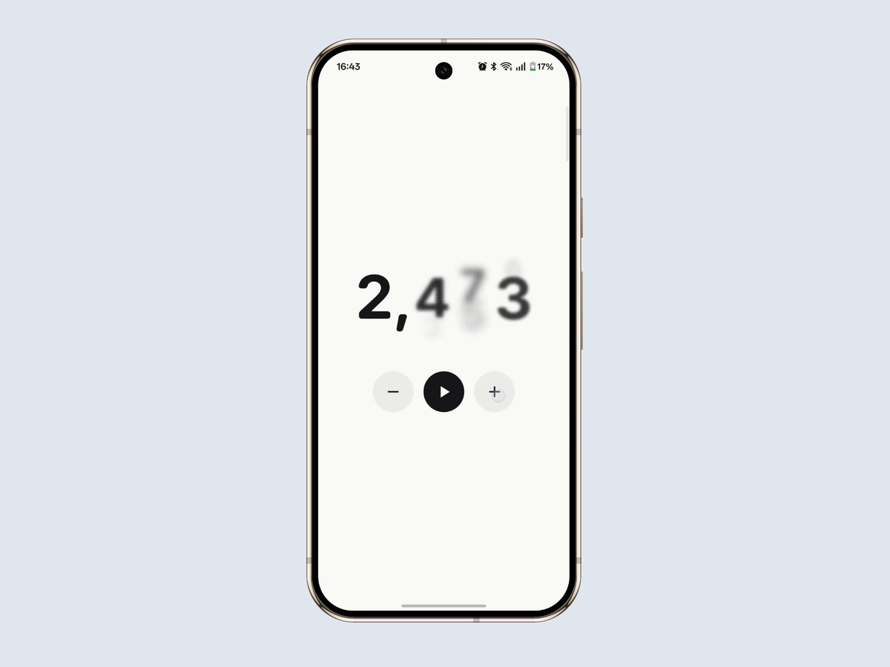

# react-native-numeric-text

High-fidelity numeric text transitions for React Native, rendered natively on iOS and Android.

`NumericText` is built for counters, balances, prices, scores, dashboards, and any interface where numeric changes are frequent enough that motion becomes part of the product experience.

On **iOS 17+**, the component uses SwiftUI's real `.contentTransition(.numericText())`. On **Android**, it uses a dedicated native renderer designed around the same interaction class: rolling digits, blur and scale, structural changes, interruption, rapid retargeting, and continuous updates.

> **v0.1 targets React Native's New Architecture (Fabric).**

## Demo

[](docs/assets/numeric-text-android-demo.mp4)

<p align="center"><sub>Google Pixel 9 Pro · Android · click the preview to play the 15-second demo</sub></p>

The example app includes a minimal showcase designed for recording the core behaviour without debug UI: ordinary changes, sustained updates, grouping boundaries, decimal boundaries, and fast reversals.

## Origin

This project started from a simple question:

**Can SwiftUI's `numericText` transition feel just as native on Android?**

The initial spark was [Nathan Schroeder's Expo UI demo](https://x.com/nater02/status/2079903810760081812), which showed how little code is needed to expose SwiftUI's native `numericText` transition on iOS.

I replied that I wanted to reproduce the behaviour on Android as well. `react-native-numeric-text` is the result of that experiment becoming a native rendering project.

The platform strategy is intentionally asymmetric:

- **iOS 17+** uses the system implementation that already exists: SwiftUI `.contentTransition(.numericText())`.
- **Android** uses a custom renderer built specifically for numeric transitions, including structural digit identity, formatted-value layout, interruption, retriggering, direction changes, and long-running interactive updates.

The goal is not to pretend both platforms render text identically. The goal is to give the same React Native component the same class of polished numeric interaction on both platforms.

This project is independent and is not affiliated with Expo or Apple.

## Why numeric text needs its own transition model

Animating a number well is not the same problem as fading one string into another.

A formatted number has structure. Digits can persist while their neighbours change, separators can appear or disappear, fractional digits are anchored differently from integer digits, and a new value can arrive before the previous animation has settled.

A production-quality transition therefore has to remain coherent through cases such as:

```text
9       -> 10
999     -> 1,000
9.99    -> 10.00
12,499  -> 12,500
```

and it has to keep behaving correctly when updates arrive continuously rather than one at a time.

`react-native-numeric-text` treats those cases as one transition system instead of a collection of isolated effects.

## Features

- Native rendering on iOS and Android.
- SwiftUI `.contentTransition(.numericText())` on iOS 17+.
- Dedicated Android numeric-transition renderer.
- Stable interruption and rapid-retarget behaviour.
- Continuous increment/decrement updates without resetting the whole animation.
- Structural handling of integer digits, fractional digits, grouping separators, decimal separators, and signs.
- Locale-aware native number formatting.
- Configurable grouping and fractional precision.
- Automatic, forced-up, and forced-down transition direction.
- System-aware reduced-motion support.
- Android 12+ hardware blur path.
- Android 7-11 compatibility blur path during animation.
- Bundled rounded Android numeric typeface with safe platform-font fallback.
- Correctly formatted static web fallback.

## Installation

```sh
npm install react-native-numeric-text
```

or:

```sh
yarn add react-native-numeric-text
```

The package autolinks through React Native. No manual Android font linking is required.

For iOS, install pods as usual after adding the dependency:

```sh
cd ios
pod install
```

## Quick start

```tsx
import { NumericText } from 'react-native-numeric-text';

export function Balance({ value }: { value: number }) {
  return (
    <NumericText
      value={value}
      style={{
        fontSize: 48,
        fontWeight: '700',
        color: '#111111',
      }}
    />
  );
}
```

The first value is rendered immediately. Later `value` changes transition natively.

## Formatting is part of the transition

Formatting is resolved before the transition is built; separators are not decorative overlays added afterward.

```tsx
<NumericText
  value={1234.5}
  locale="de-DE"
  useGrouping
  minimumFractionDigits={2}
  maximumFractionDigits={2}
/>
```

This keeps locale-specific punctuation structurally associated with the digits while the value changes.

## Direction

By default, direction follows the numeric change:

```tsx
<NumericText value={score} direction="automatic" />
```

You can force a direction independently of the value:

```tsx
<NumericText value={score} direction="up" />
<NumericText value={score} direction="down" />
```

During rapid updates, automatic direction is resolved against the value the renderer is currently targeting. A retrigger does not have to wait for the previous transition to settle.

## Reduced motion

```tsx
<NumericText value={count} reduceMotion="system" />
```

`"system"` follows the platform accessibility setting. `"always"` disables the transition. `"never"` keeps transitions enabled regardless of the system setting.

## API

### `NumericTextProps`

| Prop | Type | Default | Description |
|---|---|---|---|
| `value` | `number` | required | Number to display. The first render does not animate. |
| `locale` | `string` | `'en-US'` | BCP-47 locale used for native number formatting. |
| `direction` | `'automatic' \| 'up' \| 'down'` | `'automatic'` | Direction of the numeric transition. |
| `animationDuration` | `number` | `80` | Android only. Nominal timing input used to scale the native transition; it is not a hard duration clamp. |
| `reduceMotion` | `'system' \| 'always' \| 'never'` | `'system'` | Accessibility behaviour for motion. |
| `useGrouping` | `boolean` | `true` | Enables grouping separators. |
| `minimumFractionDigits` | `number` | `0` | Minimum number of fractional digits. |
| `maximumFractionDigits` | `number` | `3` | Maximum number of fractional digits. |
| `style` | `StyleProp<TextStyle>` | — | Text/view style. `fontSize`, `fontWeight`, `fontFamily`, and `color` are forwarded to the native renderer. |
| `testID` | `string` | — | React Native test identifier. |

When `fontSize` or `color` are omitted, the native defaults are `48` and black.

## Platform behaviour

| Platform | Behaviour |
|---|---|
| iOS 17+ | Native SwiftUI `.contentTransition(.numericText())`. |
| Earlier supported iOS | Native formatting and rendering without the unavailable numeric content transition. |
| Android API 31+ | Native renderer using `RenderNode` and `RenderEffect` for the blur path. |
| Android API 24-30 | Same transition model with a temporary software-layer blur path while animating. |
| Web | Correctly formatted static `Text`; numeric transitions are not currently animated. |

The minimum Android SDK is **24**.

## Android architecture

The Android implementation is deliberately not a grid of independent digit `Text` views.

The renderer is built around a small set of invariants:

1. **Typeset the complete formatted line first.** Layout and glyph positions come from the full value before the line is partitioned into logical transition slots.
2. **Keep immutable value rasters.** Outgoing content keeps the pixels that belonged to its original formatted value while incoming content references the new target value.
3. **Use structural identity.** Integer digits are anchored from the left, fractional digits from the decimal boundary, and punctuation receives stable semantic identity.
4. **Preserve history during retriggers.** A new target does not require the previous transition to finish first.
5. **Keep frame work bounded.** Expensive bitmap extraction and per-slot bitmap creation stay out of the normal render/update hot path.
6. **Use analytic motion evaluation.** Native transition state can be evaluated directly for the current frame instead of integrating a simulation with frame-rate-dependent state.

Those constraints let ordinary one-step changes, `999 -> 1,000`, reversals, and sustained press-and-hold updates use the same underlying model.

## Interruption and retargeting

Fast input is a first-class case rather than a stress test added after the renderer was designed.

When a value changes again during an active transition, the renderer keeps the relevant outgoing and incoming history and retargets toward the new formatted value. This avoids collapsing rapid input into a sequence of disconnected fades or restarting the entire line on every update.

The result is intended for real controls where a user may tap repeatedly, hold a button, or reverse direction while motion is still active.

## Typography

### iOS

The default presentation uses the rounded system design on Apple platforms. `fontFamily: 'system'` opts into the plain system design. A font registered by the host application can also be supplied through `style`.

### Android

Android includes a subset of [Sunghyun Sans](https://github.com/anaclumos/sunghyun-sans), an OFL-licensed rounded family used as a redistributable counterpart to the Apple rounded-system presentation. Nine real weights from 100 through 900 are bundled.

```tsx
// Default rounded presentation
<NumericText value={value} style={{ fontSize: 48 }} />

// Platform system font
<NumericText
  value={value}
  style={{ fontSize: 48, fontFamily: 'system' }}
/>

// Font registered by the host application
<NumericText
  value={value}
  style={{ fontSize: 48, fontFamily: 'Inter' }}
/>
```

The bundled Android subset contains Latin-script numeric-formatting glyphs. When a locale requires glyphs unavailable in the bundled face, the renderer falls back to the platform font rather than drawing missing-glyph boxes.

The full font license is included at `android/src/main/assets/fonts/OFL.txt`.

## Parity model

The target is **behavioural and perceptual parity**, not pixel-identical output across operating systems.

Apple and Android use different text engines, rasterizers, fonts, and rendering stacks. The useful cross-platform contract is therefore the behaviour of the transition: structural continuity, direction, interruption, retriggering, formatting changes, and motion quality.

On iOS 17+, SwiftUI itself is the reference implementation. Android is tuned against that behaviour while remaining native to Android's rendering stack.

## Performance

The Android renderer is designed for continuously changing values, not only isolated showcase transitions.

The normal animation path avoids per-frame bitmap extraction and per-slot bitmap creation. API 31+ uses cached native rendering primitives and `RenderEffect`; API 24-30 temporarily switches only the numeric view to the software blur path while it is animating, then restores the normal layer state.

This matters for counters with press-and-hold controls, live balances, scores, timers, and rapidly updating dashboards.

## Example app

The repository includes an `example/` application used both as a public showcase and as a development harness.

The public screen is intentionally minimal: one number, two controls, and a deterministic demo sequence. A separate lab remains available for deeper validation without exposing diagnostic UI in recordings or screenshots.

The example application is part of the repository but intentionally excluded from the published npm package.

## Release verification

Before a release candidate is published, the repository verification gate runs:

```sh
yarn install --immutable
yarn check
yarn prepare
npm pack --dry-run
```

The generated package is then tested as a real tarball from a clean consumer project rather than relying only on workspace resolution.

## License

MIT.

The bundled Sunghyun Sans assets are distributed under the SIL Open Font License 1.1; see `android/src/main/assets/fonts/OFL.txt`.
