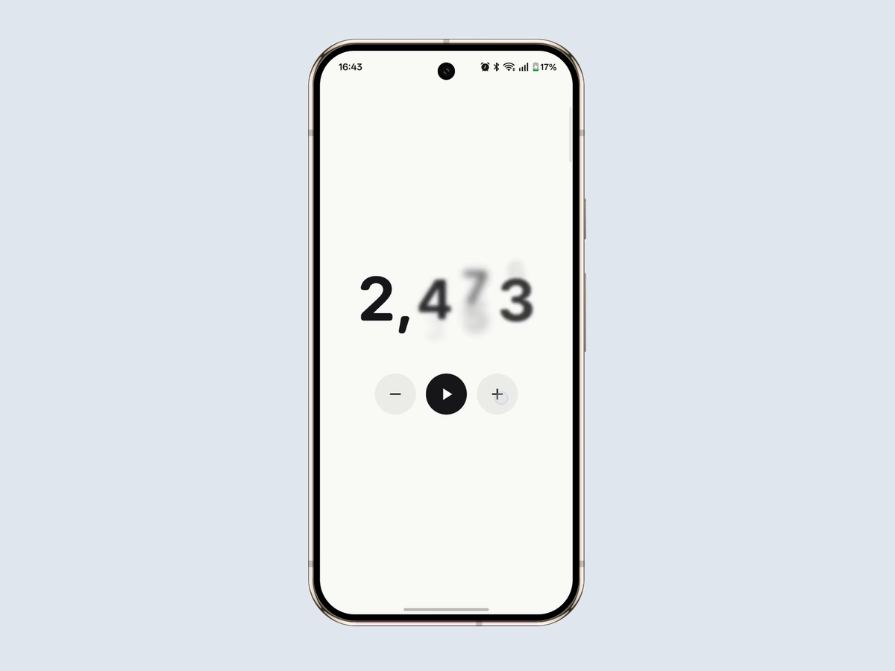

# react-native-numeric-text

Native, high-fidelity numeric text transitions for React Native — SwiftUI's real `numericText` on iOS, and a renderer measured against it, digit for digit, on Android.

[](https://www.npmjs.com/package/react-native-numeric-text)
[](./LICENSE)


`NumericText` is for counters, balances, prices, scores, timers, and any interface where numbers change often enough that the motion becomes part of the product. Each digit column rolls on its own spring, structural changes (`999 → 1,000`) stay coherent, and rapid updates keep their motion instead of restarting.

## Demo

[](docs/assets/numeric-text-android-demo.mp4)

<p align="center"><sub>Google Pixel 9 Pro · Android · click to play the demo</sub></p>

On **iOS 17+** the component uses SwiftUI's own `.contentTransition(.numericText())`. On **Android** it uses a dedicated native renderer built for the same interaction class — and tuned against the iOS output frame by frame (see [How it works](#how-it-works)).

> Targets React Native's **New Architecture (Fabric)**.

## Why

Animating a number well is not the same problem as fading one string into another. A formatted number has structure: digits persist while their neighbours change, separators appear and disappear, fraction digits are anchored differently from integer digits, and a new value can arrive before the previous animation has settled.

```text
9      → 10
999    → 1,000
9.99   → 10.00
12,499 → 12,500
```

`react-native-numeric-text` treats these as one transition system rather than a pile of isolated effects, natively on both platforms.

## Features

- Native rendering on iOS and Android — no JS-driven per-digit animation.
- SwiftUI `.contentTransition(.numericText())` on iOS 17+; a measured native renderer on Android.
- Stable interruption and rapid-retarget behaviour; continuous increment/decrement without restarting.
- Structural handling of integer digits, fraction digits, grouping/decimal separators, and signs.
- Locale-aware native formatting via an `Intl.NumberFormat`-shaped `format` prop.
- Currency (symbol or ISO code, accounting negatives) and percent, resolved natively.
- Identical rounding across iOS, Android, and web.
- Optional Reanimated **shared value** as the `value`, driven from the UI thread.
- Two-colour amounts (`fractionColor`) and left / center / right alignment that holds through the animation.
- System-aware reduced-motion support.

## Installation

```sh
npm install react-native-numeric-text
```

```sh
yarn add react-native-numeric-text
```

The package autolinks. On iOS, install pods after adding the dependency:

```sh
cd ios && pod install
```

`react-native-reanimated` (>= 3) is an **optional** peer dependency, needed only to pass a shared value as `value`. Nothing imports it otherwise, so apps that pass plain numbers do not need it installed.

## Quick start

```tsx
import { NumericText } from 'react-native-numeric-text';

export function Balance({ value }: { value: number }) {
  return (
    <NumericText
      value={value}
      style={{ fontSize: 48, fontWeight: '700', color: '#111111' }}
    />
  );
}
```

The first value renders immediately; later `value` changes transition natively.

## Usage

### Formatting

`format` is a subset of `Intl.NumberFormatOptions`, resolved by each platform's own formatter (`NumberFormatter` on iOS, `android.icu` on Android, `Intl` on web). The number is produced where it is drawn, so the renderer animates the structure of a formatted number rather than a string handed to it.

```tsx
<NumericText
  value={1234.5}
  locale="de-DE"
  format={{ useGrouping: true, minimumFractionDigits: 2, maximumFractionDigits: 2 }}
/> // 1.234,50
```

> `format` is an object — hoist it to module scope or wrap it in `useMemo` if you rely on the component skipping re-renders.

### Currency and percent

```tsx
<NumericText value={1234.5} currency="USD" />                    // $1,234.50
<NumericText value={1234.5} currency="JPY" />                    // ¥1,235
<NumericText value={1234.5} locale="de-DE" currency="EUR" />     // 1.234,50 €
<NumericText value={0.42} format={{ style: 'percent' }} />       // 42%
```

`currency` is shorthand for `format={{ style: 'currency', currency }}`. The affix takes part in the transition — keyed by its distance from the digits, so `$999 → $1,000` slides one `$` left instead of destroying and recreating it. Fraction digits follow the currency when unset (2 for USD, 0 for JPY, 3 for BHD).

### Two-colour amounts

`fractionColor` draws the fraction span — the decimal separator, the digits after it, and any trailing affix — in a second colour, so the figure that matters reads first. The fraction rolls together with the rest of the digits.

```tsx
<NumericText
  value={balance}
  currency="USD"
  style={{ fontSize: 50, color: '#FFFFFF' }}
  fractionColor="#8A9BA8"
/> // "$1,234" white, ".56" grey
```

### Alignment

By default a number grows and shrinks about its **centre**. Set `textAlign` in `style` to pin an edge instead — the aligned edge then stays fixed for the whole transition, incoming and outgoing, so a left-aligned counter never drifts sideways as it changes width.

```tsx
<NumericText value={value} style={{ fontSize: 48, textAlign: 'left' }} />
```

Only `'left' | 'center' | 'right'` are honoured; `'auto'` and `'justify'` fall through to the default (`center`).

### Direction and reduced motion

```tsx
<NumericText value={score} direction="up" />       // 'automatic' | 'up' | 'down'
<NumericText value={count} reduceMotion="system" /> // 'system' | 'always' | 'never'
```

`direction` defaults to `'automatic'` (rolls up when the value grows, down when it shrinks). `reduceMotion` `'system'` follows the OS accessibility setting, `'always'` disables the transition, `'never'` keeps it regardless.

### Shared values (Reanimated)

`value` also takes a Reanimated shared value. The number it carries is written into the native view from the UI thread, so a value driven by a gesture, a spring, or a timing reaches the renderer without crossing to JavaScript and without re-rendering anything.

```tsx
import { Pressable } from 'react-native';
import { NumericText } from 'react-native-numeric-text';
import { useSharedValue, withTiming } from 'react-native-reanimated';

export function Balance() {
  const amount = useSharedValue(1240.5);
  return (
    <Pressable onPress={() => (amount.value = withTiming(0, { duration: 2600 }))}>
      <NumericText value={amount} currency="USD" style={{ fontSize: 48 }} />
    </Pressable>
  );
}
```

A `DerivedValue` works the same way. A plain number and a shared value are rendered by different components, so pick one per component for its lifetime — switching remounts the native view. On platforms without the native renderer the shared value is mirrored into React state and drawn as static text.

## API

### `NumericTextProps`

| Prop | Type | Default | Description |
|---|---|---|---|
| `value` | `number \| SharedValue<number>` | required | Number to display. The first render does not animate. A shared value is driven from the UI thread. |
| `locale` | `string` | `'en-US'` | BCP-47 locale for native formatting. Defaults to `en-US` rather than the device locale so layout does not change with the device language. |
| `format` | `NumericTextFormat` | `{}` | Shape of the number. See below. |
| `currency` | `string` | — | Shorthand for `format={{ style: 'currency', currency }}`. `format` wins where they overlap. |
| `direction` | `'automatic' \| 'up' \| 'down'` | `'automatic'` | Direction of the roll. |
| `animationDuration` | `number` | `320` | **Android only.** Nominal spring duration in ms; scales the transition (floored at `80`). Ignored on iOS, whose transition has its own fixed timing. |
| `reduceMotion` | `'system' \| 'always' \| 'never'` | `'system'` | Motion accessibility behaviour. |
| `useGrouping` | `boolean` | `true` | Shorthand for the same field of `format`. |
| `minimumFractionDigits` | `number` | — | Shorthand for the same field of `format`. |
| `maximumFractionDigits` | `number` | — | Shorthand for the same field of `format`. |
| `fractionColor` | `ColorValue` | — | Second colour for the fraction span. |
| `style` | `StyleProp<TextStyle>` | — | `fontSize`, `fontWeight`, `fontFamily`, `color`, and `textAlign` (`left`/`center`/`right`) are forwarded to the native renderer; the rest applies to the view. Native defaults: size `48`, colour black, alignment `center`. |
| `testID` | `string` | — | Test identifier. |

Plus the standard React Native accessibility props.

### `NumericTextFormat`

A subset of `Intl.NumberFormatOptions`, resolved by each platform's own formatter.

| Option | Type | Default | Description |
|---|---|---|---|
| `style` | `'decimal' \| 'currency' \| 'percent'` | `'decimal'` | `'currency'` needs `currency`; `'percent'` multiplies by 100. |
| `currency` | `string` | — | ISO 4217 code. |
| `currencyDisplay` | `'symbol' \| 'code'` | `'symbol'` | `$1,234.56` or `USD 1,234.56`. |
| `currencySign` | `'standard' \| 'accounting'` | `'standard'` | `'accounting'` brackets negatives; applies with `currencyDisplay: 'symbol'`. |
| `useGrouping` | `boolean` | `true` | Grouping separators. |
| `minimumIntegerDigits` | `number` | — | Pads with leading zeros to this width. |
| `minimumFractionDigits` | `number` | style's own | `0` decimal/percent; the currency's count for money. |
| `maximumFractionDigits` | `number` | style's own | `3` decimal, `0` percent; the currency's count for money. |
| `minimumSignificantDigits` | `number` | — | Takes precedence over the fraction bounds. |
| `maximumSignificantDigits` | `number` | — | Takes precedence over the fraction bounds. |

Rounding is fixed at **half-away-from-zero** on both platforms and web (`Intl`'s default) so the two renderers never disagree on the number they draw. `Intl` options that are intentionally not supported — `currencyDisplay: 'name'`/`'narrowSymbol'`, `notation: 'compact'`, `signDisplay`, `unit`, `roundingMode` — and the reasons are documented in [docs/ARCHITECTURE.md](docs/ARCHITECTURE.md).

## Platform behaviour

| Platform | Behaviour |
|---|---|
| iOS 17+ | SwiftUI `.contentTransition(.numericText())`, formatted by `NumberFormatter`. |
| Earlier iOS | Native formatting and rendering, without the unavailable numeric transition. |
| Android API 31+ | Native renderer with `RenderNode` + `RenderEffect` blur, formatted by `android.icu`. |
| Android API 24–30 | Same transition model with a software-layer blur path while animating. |
| Web | Correctly formatted static text via `Intl`; the transition is not animated. |

Minimum Android SDK is **24**.

## How it works

The Android renderer is not a grid of independent digit views. It typesets the full formatted line, keeps immutable value rasters, gives every digit and separator a **structural identity** (integer digits anchored from the left, fraction digits from the decimal mark, affixes keyed by distance from the digits), and evaluates the motion analytically per frame so continuous updates stay cheap.

Its parameters are not taste — they were **measured against SwiftUI's output**. The iOS transition was recorded frame by frame and decomposed per glyph into offset, scale, blur, and opacity; Apple's constants (a one-sided entry offset of `0.59375` glyph heights, a birth/death scale of `0.3984375`, two separate clocks for position vs size/opacity, a fixed `0.15 s` left-to-right cascade) fell out of the fit and are what the Android engine reproduces.

Two documents cover this in full:

- **[docs/ARCHITECTURE.md](docs/ARCHITECTURE.md)** — the renderer's design and the measured transition model.
- **[docs/METHODOLOGY.md](docs/METHODOLOGY.md)** — how the model was reverse-engineered from a closed-source animation: the measurement techniques, the iteration protocol, and the assumptions the data falsified.

The raw derivation — every ground-truth recording, the measurement scripts, and the iteration-by-iteration log — is preserved on the [`research/engine-derivation`](https://github.com/AmatoGiulio/react-native-numeric-text/tree/research/engine-derivation) branch rather than carried on `main`.

## Example app

The `example/` app is a public showcase and a development harness; it is excluded from the published npm package. `example/src/SharedValueLab.tsx` drives the component from a shared value and prints React's render count beside it — the number rolls, the count does not move.

## Credits

- The formatting API — one `Intl`-shaped `format` object — is borrowed from [`number-flow`](https://github.com/barvian/number-flow) by Maxwell Barvian.
- Currency and percent formatting began as a contribution by [@Amanfromearth](https://github.com/Amanfromearth) in [#4](https://github.com/AmatoGiulio/react-native-numeric-text/pull/4).
- The original spark was [Nathan Schroeder's Expo UI demo](https://x.com/nater02/status/2079903810760081812) of SwiftUI `numericText` on iOS.

Independent project; not affiliated with Expo, Apple, or `number-flow`.

## License

MIT. The bundled Android numeric typeface (a subset of [Sunghyun Sans](https://github.com/anaclumos/sunghyun-sans)) is distributed under the SIL Open Font License 1.1; see `android/src/main/assets/fonts/OFL.txt`.
